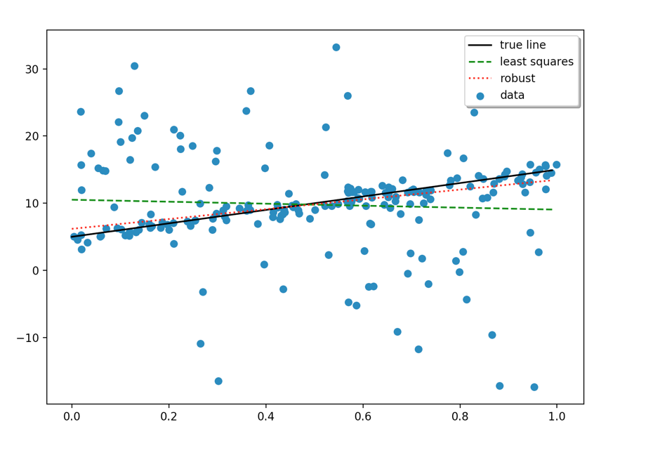

In this problem you will compare least-squares and robust regression on a synthetic data set.  
The first part creates a data set for linear regression.
Most of the data come from an upward sloping line plus noise, but a fraction (thought of as outliers) come from a downward sloping line.

(a)Argue that for general ρ satisfying the lemma in the notes on robust regression, the majorize-minimize algorithm can be understood as “iteratively reweighted least squares.” 
Explain how the algo-rithm achieves robustness by considering how weights are assigned to outliers vs.  inliers in comparisonwith the least squares loss.

(b)Consider the robust lossρ(r) =√1 +r2−1.
Implement the MM algorithm, and report the parameters of the linear function you estimated.  
Forcomparison, also report the parameters of ordinary least squares on this data.

(c)Generate  a  single  plot  that  shows  the  data,  the  true  line,  the  OLS  estimate,  and  the  robustestimate.  
Create a legend and use different line styles.

